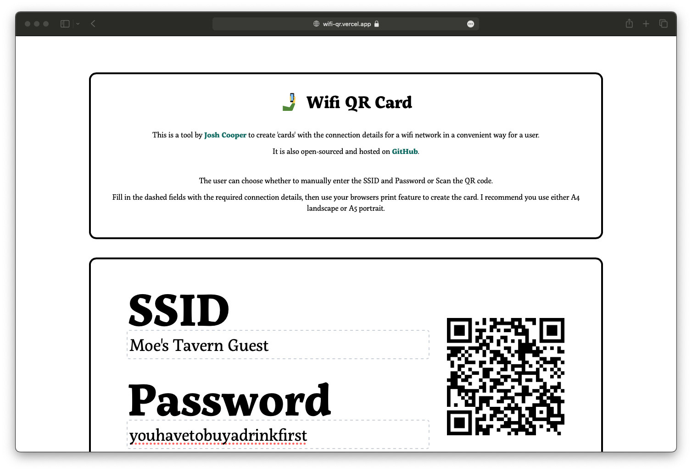
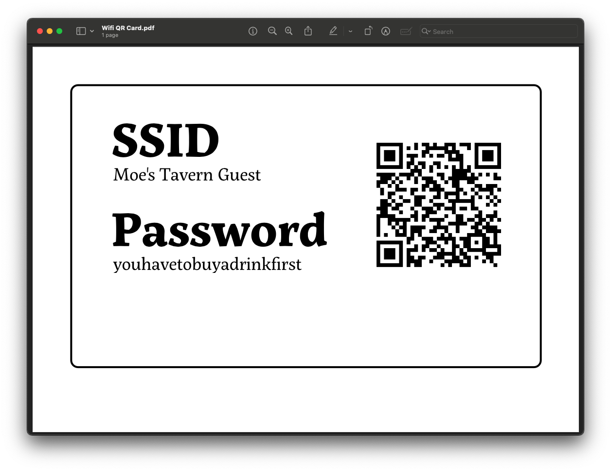

# 🤳 Wifi QR Card

This is a tool to create 'cards' with the connection details for a wifi network in a convenient way for a user.

You can go to the [website](https://wifi-qr.vercel.app) and fill in your connection details.

Once you're happy, use your browser to print the page (I recommend turning off Headers and Footers, and if you're having any trouble, try using Chrome.)

Then you'll have a card like this you can print. 

If you face any problems with this tool, feel free to open a ticket (or better yet, a PR).